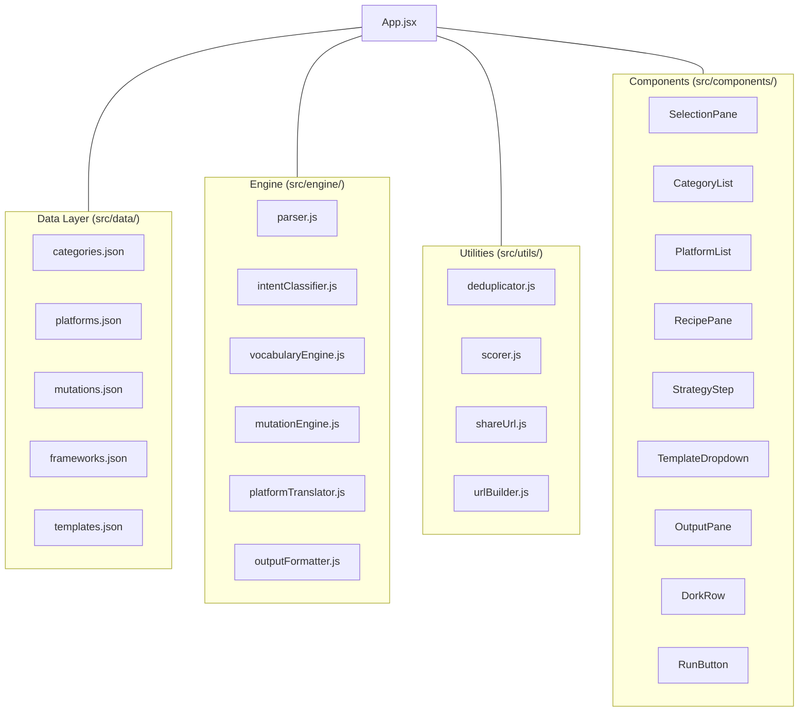
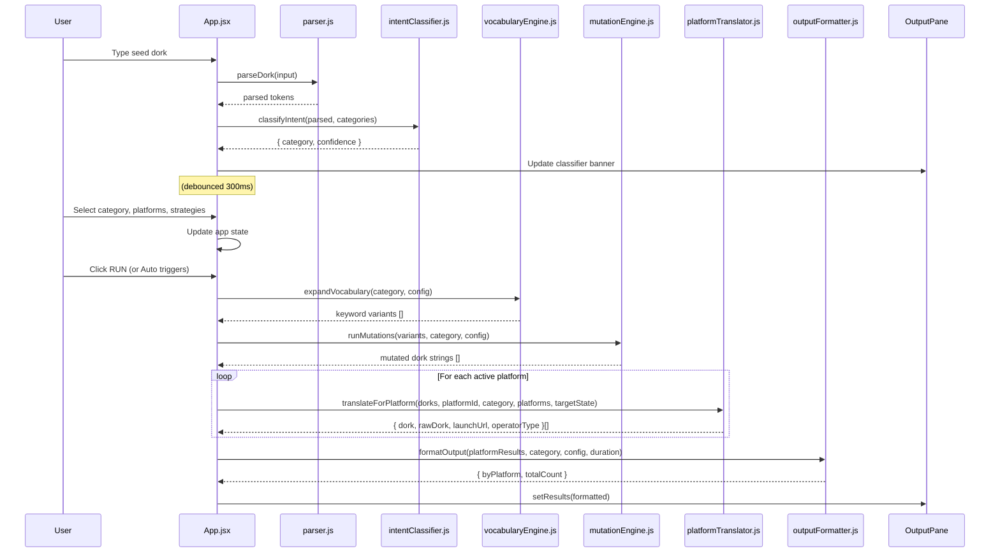
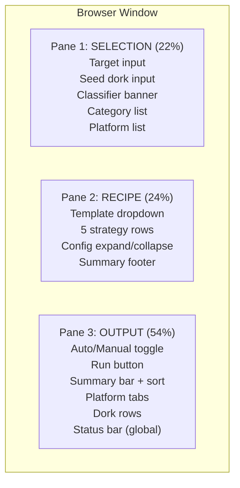
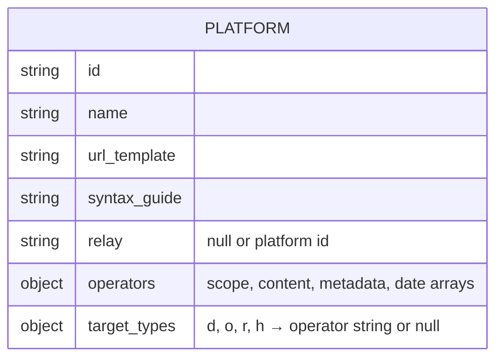

## System Architecture

DorkShift is a purely client-side single-page application. There is no backend, no database, and no network requests during generation. The only network action is `window.open()` when a user clicks a launch URL.

### High-Level Architecture



### Data Flow — Generation Pipeline



### Three-Pane Layout



### Component Tree

```
App.jsx
├── SelectionPane
│   ├── CategoryList
│   └── PlatformList
├── RecipePane
│   ├── TemplateDropdown
│   └── StrategyStep (×5)
└── OutputPane
    └── DorkRow (×N)
```

### State Architecture

All application state lives in `App.jsx`. Components receive state and callbacks as props. No component holds application-level state — only UI-local state (hover, focus, expand/collapse) is kept in components.

**Key state fields:**

| Field | Type | Purpose |
|-------|------|---------|
| `seedInput` | string | Raw seed dork text |
| `selectedCategoryId` | string \| null | Active category |
| `activePlatformIds` | string[] | Enabled platform IDs |
| `enabledMutationIds` | string[] | Enabled mutation strategy IDs |
| `mutationConfigs` | object | Per-mutation config values |
| `classifierResult` | object \| null | Latest classification result |
| `targetType` | string \| null | Target prefix type (d/o/r/h) |
| `targetValue` | string | Target value |
| `results` | object \| null | Generated output |
| `selectedTemplate` | object \| null | Active template |

### Data Schema — platforms.json



### Engine Module Contracts

| Module | Export | Input | Output |
|--------|--------|-------|--------|
| parser.js | `parseDork` | `rawInput: string` | `{ tokens[], platform, type, raw }` |
| parser.js | `parseTarget` | `rawInput: string` | `{ type, value, seedInput, valid, label }` |
| intentClassifier.js | `classifyIntent` | `parsedToken, categories[]` | `{ category, confidence, matchedKeywords[] }` |
| vocabularyEngine.js | `expandVocabulary` | `category, mutationConfig` | `string[]` |
| mutationEngine.js | `runMutations` | `variants[], category, config` | `string[]` |
| platformTranslator.js | `translateForPlatform` | `dorkStrings[], platformId, category, platforms[], targetState` | `{ dork, rawDork, launchUrl, operatorType }[]` |
| platformTranslator.js | `applyTargetOperator` | `dorkString, targetState, platformData, allPlatforms` | `{ displayDork, rawDork, operatorType }` |
| outputFormatter.js | `formatOutput` | `platformResults, category, config, duration` | `{ byPlatform, totalCount, raw, duration }` |
